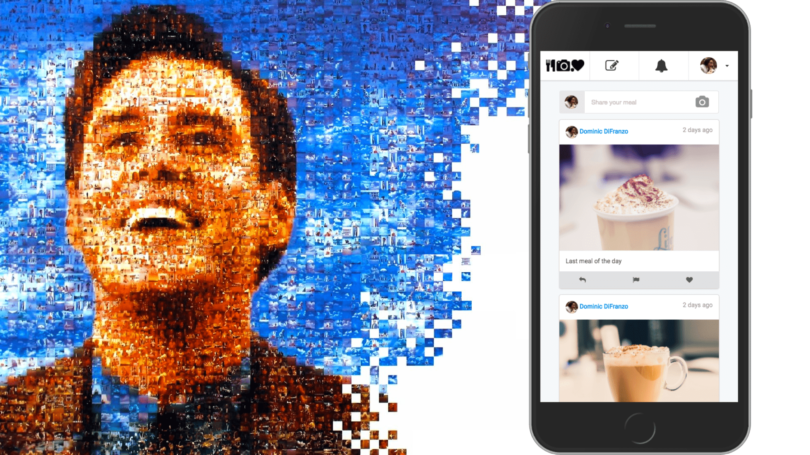

# Truman Agents

## Introduction

Truman Agents is a **complete, open-source social media simulation platform** with LLM-powered autonomous agents, which can be used as a testbed to explore different research questions.

For example, how do social norms spread on social media through a behavioral contagion process? How to encourage people to be upstanders when encountering cyberbullying? How to mitigate the effects of misinformation prevalence in social media?

## What is Truman Agents?

Truman Agents is an extension of the [Truman Platform](https://github.com/cornellsml/truman), an open-source social media simulation platform originally created by [The Cornell Social Media Lab](https://socialmedialab.cornell.edu/). Truman Agents and its companion agent engine [TrumanWorld](https://github.com/Cornell-Design-AI-Group/TrumanWorld) are developed by the [DesignAI Group at Cornell](https://designai.cis.cornell.edu/).

Truman Agents adds LLM-driven autonomous agents, game mechanics (levels, objectives, scoring), real-time multi-user support, and integration with TrumanWorld, a separate Python service that drives autonomous agent behavior.

Researchers can create different social media environments with a repertoire of features and affordances that fit their research goals and purposes, while ensuring participants have a naturalistic social media experience.

Specifically, researchers can:

- Simulate realistic and interactive timelines and newsfeeds, by curating, creating, and controlling every "actor" (a simulated user on the website), post, like, comment, notification, and interaction that appears on the platform
  - "Actors" are fully scripted, while "Agents" can be LLM-driven or scripted, with configurable roles (e.g., bully, victim, bystander, informer), backstories, behavior prompts, and personality traits
- Allow multiple participants to interact on the same feed
- Structure participant experiences with levels, objectives, scoring, and win/loss conditions
- Create experiments with random assignment and exposure of participants to different experimental conditions
- Collect a variety of participant behavioral metrics on the platform (including how they interact with posts and comments, how long they are on the site, and more)

Truman Agents manages parallel simulations for all study participants. Study participants don't connect or interact with any other real participant on the website, even though they believe they do, and all participants receive the same social media experience, except for variations controlled by the experimental condition of the study and the participant's own posting behavior.

As a result, Truman Agents gives researchers lab-like control over study conditions while maintaining a realistic, naturalistic, ecologically-valid social media setting.

## Want to install Truman Agents?

Start exploring our codebase and the steps on how to deploy your version of Truman Agents:

[Installing Truman Agents](/docs/setting-up-truman/installing-truman/index.md)

## Want to explore more?

Curious to see how you can use it for your experiment? Jump in to our start docs:

[Initial Experimental Design](/docs/getting-started/initial-experimental-design.md)

| [Next Initial Experimental Design](/docs/getting-started/initial-experimental-design.md) |
| ------------------------------------------------------------------------------------------- |
